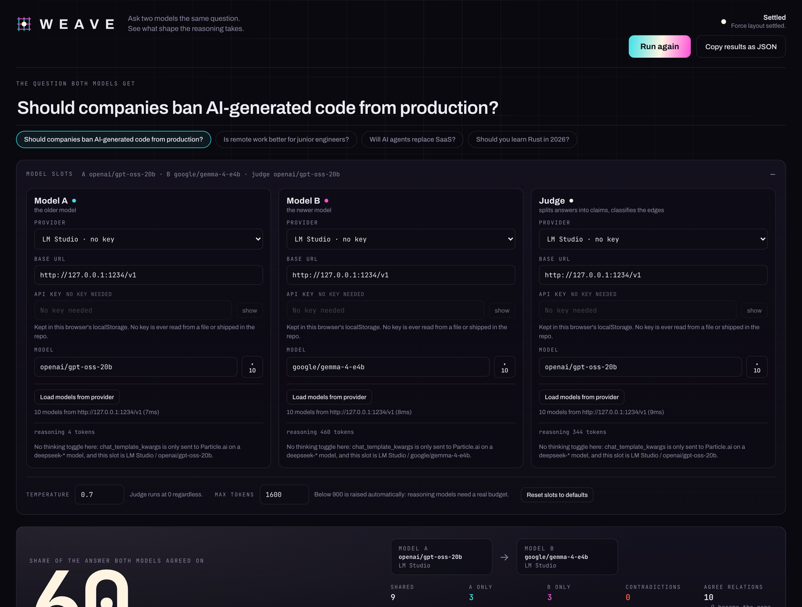
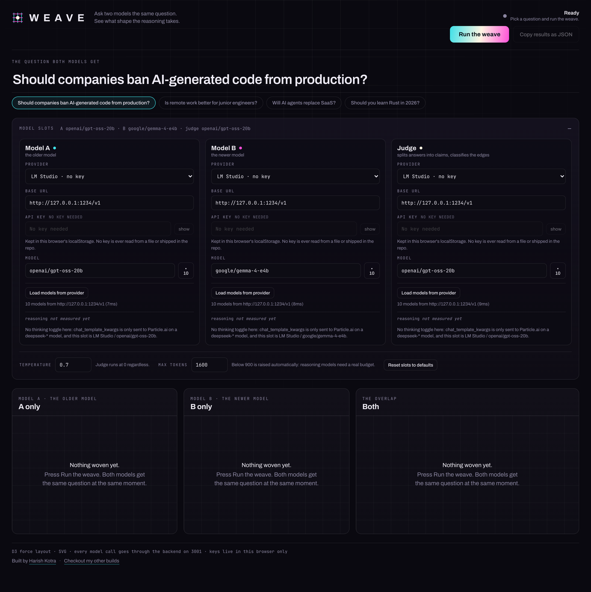
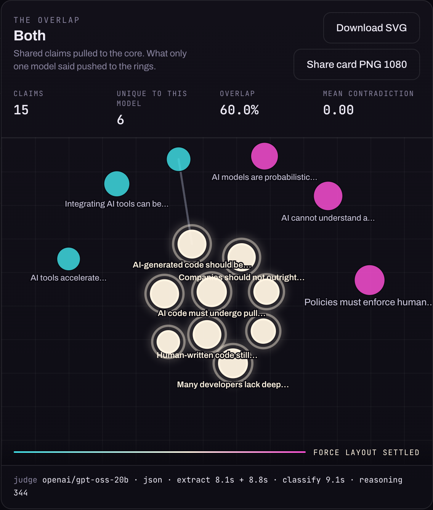

# Weave

Ask two models the same question. Turn each answer into a graph. See what shape the reasoning takes.

Weave sends one question to two models at the same moment, hands both answers to a third
slot (the judge), and turns the result into three force-directed graphs: **A only**,
**B only**, and **Both**. Each atomic claim is a node, sized by how much text it took to
say, coloured by which model said it. Shared claims are pulled into a white consensus core;
claims only one model made are pushed out to the rings. Agree edges are solid grey,
contradictions are dashed red.

The headline number is the share of the answer both models agreed on, measured from node
overlap — not from string similarity, not from an embedding.


https://github.com/user-attachments/assets/87a0761f-0770-4c5a-a23f-47345c9da091


```
                    one question, sent to both at the same instant
                                    │
                    ┌───────────────┴───────────────┐
                    ▼                               ▼
            ┌───────────────┐               ┌───────────────┐
            │   Model A     │               │   Model B     │
            │  (any provider)│              │  (any provider)│
            └───────┬───────┘               └───────┬───────┘
                    │ answer A                      │ answer B
                    └───────────────┬───────────────┘
                                    ▼
                          ┌───────────────────┐
                          │   Judge slot      │   EXTRACT: answer → atomic claims
                          │  (its own provider)│  CLASSIFY: cross-model pairs
                          └─────────┬─────────┘
                                    │ claims + {a, b, relation, strength}
                                    ▼
                          ┌───────────────────┐
                          │  matching + graph │   consensus core, rings, edges
                          └─────────┬─────────┘
                                    ▼
              ┌─────────────────────┼─────────────────────┐
              ▼                     ▼                     ▼
        ┌──────────┐          ┌──────────┐          ┌──────────┐
        │ A only   │          │ B only   │          │  Both    │
        │ (cyan)   │          │ (magenta)│          │ (core)   │
        └──────────┘          └──────────┘          └──────────┘
```



*One real run: `openai/gpt-oss-20b` against `google/gemma-4-e4b`, judged by `gpt-oss-20b`.
9 shared claims, 3 each only one model made, 60% consensus, 54.8s.*

---

## Table of contents

- [Quick start](#quick-start)
- [What you see on screen](#what-you-see-on-screen)
- [How one run works](#how-one-run-works)
- [The three views](#the-three-views)
- [Architecture](#architecture)
- [Technologies](#technologies)
- [The interesting parts, in code](#the-interesting-parts-in-code)
- [Capability detection, never assumptions](#capability-detection-never-assumptions)
- [Providers](#providers)
- [Ports](#ports)
- [Repository map](#repository-map)
- [Verification](#verification)
- [Fork it and contribute](#fork-it-and-contribute)
- [Feature ideas](#feature-ideas)
- [Non-goals](#non-goals)
- [Credits](#credits)

---

## Quick start

```bash
git clone <this repo> weave && cd weave
npm install
npm run dev
```

Open **http://localhost:5173**, paste a key into the Model A / Model B / Judge slots (they
are saved in your browser's localStorage), and press **Run the weave**.

No API key exists anywhere in this repository, and nothing is read from a `.env` file. Keys
are typed into the UI, sent only to the local backend, and used only for that provider's
`/chat/completions`.

Requirements: Node 20+. No database, no Docker, no build step for the backend.

**Try it with zero cost and zero keys:** run [Ollama](https://ollama.com) or
[LM Studio](https://lmstudio.ai), pick that provider in all three slots, and load a model
into each. Everything works offline.

---

## What you see on screen

Three slots, each with its own provider, base URL, key and model. Keys are typed here and
saved in this browser only:



| Panel | What is in it |
| --- | --- |
| **A only** | every claim Model A made. Cyan nodes. Links are a bipartite projection: two of A's claims that touch the same claim in B are linked — solid if they agree with it the same way, dashed if they disagree. |
| **B only** | the same for Model B, magenta. |
| **Both** | the overlap. Each matched pair of claims merges into one white node with a halo ring — that is the consensus core. Claims only one model made are pushed outward into two rings. |

Above each panel: claim count, unique count, overlap %, mean contradiction strength. Above
the three panels: the one loud number in the interface — **the share of the answer both
models agreed on** — plus claims linked across models and the same overlap measured by text
volume. Under the panels: an evidence block that prints the node-count proof, the edge
provenance, the consensus arithmetic, the reasoning-token readings, the prompt-nonce check
and both answer hashes. Nothing on that screen is decoration; every number is computed from
the run that just happened.

The overlap view on its own, which is also what the 1080×1080 share card renders:



Exports: **Download SVG** per panel, a 1080×1080 **PNG share card** of the overlap view, and
**Copy results as JSON** with the raw claims, edges, judge pairs and prompts.

---

## How one run works

```
[0.0s]  asking       A and B called concurrently, byte-identical question text
[13.5s] extracting   judge splits answer A and answer B into atomic claims (concurrently)
[21.6s] classifying  judge returns cross-model pairs {a, b, agree|contradict, strength}
[21.7s] matching     maximum bipartite matching over agree pairs → consensus core
[21.8s] simulating   d3-force runs until the layout settles, panels report progress
```

Each stage is a real `progress` event from the backend, not a timer. If the judge is slow,
"extracting" sits on screen for as long as extraction takes.

Every model call carries a fresh random nonce in the prompt, and the run asserts that all
five prompts (A, B, extract A, extract B, classify) were unique — so a provider-side cache
can never serve you a previous answer.

### Prompts and budgets, exactly

```
POST /api/weave { question, config }              Server-Sent Events
  │
  ├─ asking        A and B called CONCURRENTLY with the identical question text
  │                 system: "You are a precise assistant. Answer the user's request directly."
  │
  ├─ extracting    judge call #1 (twice, concurrently, one per answer)
  │                 "Split the following answer into atomic claims. Return JSON array of
  │                  strings, max 12 items. No commentary."
  │
  ├─ classifying   judge call #2 (once, over both claim lists)
  │                 {"pairs":[{"a":i,"b":j,"relation":"agree"|"contradict","strength":0..1}]}
  │                 capped at 30 pairs, empty array allowed
  │
  ├─ simulating    client-side d3-force layout, three panels at once
  └─ settled
```

Judge system prompt: `You are a strict JSON API. Output only valid JSON.` Judge temperature
is 0. A/B temperature comes from the config. `max_tokens` defaults to 1600 (judge 2000) and
is never allowed below 900 — reasoning models need a real budget.

### When the judge does not return JSON

Judge output goes through a tolerant parser (fences, prose preambles, smart quotes, trailing
commas, Python literals, single quotes, balanced-bracket extraction). If it still fails, the
call is retried once. If it fails twice:

- claims fall back to sentence splitting, and
- edges fall back to **lexical Jaccard similarity** over stopword-filtered token sets
  (threshold 0.32; a negation mismatch above 0.45 is marked a contradiction).

Either fallback labels the view **`fallback: lexical`** in the headline, in the panel footer,
in the share card and in the copied JSON, and adds a warning. Lexical edges are never
presented as semantic ones.

---

## The three views

| Panel | Nodes | Edges |
| --- | --- | --- |
| **A only** | A's claims | projection of the judge's cross-model relations |
| **B only** | B's claims | projection of the judge's cross-model relations |
| **Both** | matched pairs merged into one consensus node, plus each model's unique claims | every cross-model relation, mapped through the merge |

The projection in the A/B panels is derived, not invented: when two of A's claims are linked
to the *same* claim in B, they are on the same side when the judge gave them the same
relation (drawn solid) and opposed when it gave different relations (drawn dashed). Nothing
is drawn that the judge did not classify.

In the **Both** panel the consensus core is pulled to the centre by a stronger centering
force, unique claims are pushed out by a radial force, and node radius is `sqrt(claim
length)` — so how much text it took to say something is visible as size.

### The consensus number

- Agree pairs with strength ≥ 0.5 form a **maximum matching** (Kuhn's algorithm, candidate
  lists sorted by judge strength then lexical similarity), so every claim is counted at most
  once and the result cannot depend on the order the judge listed its pairs in.
  Contradictions never form consensus.
- `sharedPairs` = matched pairs, `aOnly` / `bOnly` = claims left over.
- **Consensus by nodes** = `sharedPairs / (sharedPairs + aOnly + bOnly)`. Two identical
  answers score 100%.
- **Claims linked across models** = claims with at least one agree relation to the other
  answer, ÷ all claims. This is the generous reading: it stays high when the two answers agree
  but split the same point into a different number of claims.
- **Consensus by text** = matched characters ÷ all characters. All three are shown.

---

---

## Architecture

```
┌──────────────────────────────── browser ────────────────────────────────┐
│  React 18 + TypeScript (Vite)                                            │
│                                                                          │
│   App.tsx ── state machine: idle → asking → extracting → classifying     │
│            → simulating → settled                                        │
│      │                                                                   │
│      ├── SlotCard ×3        provider / base URL / key / model per slot   │
│      ├── GraphPanel ×3      d3-force → SVG, drag, hover, export          │
│      └── lib/api.ts         fetch + ReadableStream (SSE frames)          │
│                                                                          │
│   localStorage: weave.config.v1  (keys never leave this browser except   │
│                                   to the backend below)                  │
└────────────────────────────────┬─────────────────────────────────────────┘
                                 │  POST /api/weave   (text/event-stream)
                                 │  POST /api/models  (JSON)
                                 ▼
┌──────────────────────── backend (Express, port 3001) ───────────────────┐
│  index.ts      routes, SSE framing, keepalive comments                   │
│  weave.ts      orchestration: A ∥ B → extract ∥ extract → classify       │
│  providers.ts  the ONLY module that speaks to a model provider           │
│  judge.ts      prompts, tolerant parsing, retry, lexical fallback        │
│  graph.ts      maximum-matching consensus, panels, stats                 │
│  json.ts       parseJsonLoose (fences, prose, trailing commas, …)        │
└───────┬─────────────────────┬─────────────────────┬─────────────────────┘
        │                     │                     │
        ▼                     ▼                     ▼
  Particle.ai            Ollama / LM Studio     OpenRouter / Custom
  (key required)         (no key, localhost)    (key required)
```

Three rules hold the shape of this codebase together:

1. **The browser never calls a model provider.** Every request goes through the backend.
   That is what makes local providers work without CORS setup and keeps keys off the client.
2. **`server/providers.ts` is the only module that speaks HTTP to a provider.** Adding a
   provider means adding a preset, not touching the pipeline.
3. **The graph is built from judge output, never from string matching of the answers.**
   The lexical path exists, but it announces itself in the UI and in the JSON.

---

## Technologies

| Layer | Choice | Why this one |
| --- | --- | --- |
| Build | **Vite 6** | instant dev server, proxy for `/api`, zero-config TS |
| UI | **React 18 + TypeScript 5.7** (strict) | the state machine is small; strict mode catches the D3 typing traps |
| Graphs | **d3-force, d3-selection, d3-drag, d3-zoom** → **SVG** | forces and SVG only. No three.js, no graph library on top of D3 — the layout *is* the point, so it is not hidden behind an abstraction |
| Backend | **Node + Express 4 + tsx** | one process, no build step, SSE out of the box |
| Transport | **Server-Sent Events over POST** | the staged UI shows the real pipeline stages; EventSource cannot POST |
| Model calls | **plain `fetch`** to `{baseUrl}/chat/completions` | no SDK, so any OpenAI-compatible endpoint works, including `http://127.0.0.1:1234/v1` |
| Fonts | **Archivo Variable + JetBrains Mono Variable** (self-hosted via `@fontsource-variable`) | no network dependency at runtime; numbers get a mono face |
| Verification | **`node:fetch` script + Playwright** | one hits the API, the other drives the real page |

Seven runtime dependencies. That is the whole list.

---

## The interesting parts, in code

### 1. The judge is a JSON API, not a chatbot

```ts
// server/judge.ts
export const JUDGE_SYSTEM = 'You are a strict JSON API. Output only valid JSON.';

export function buildExtractPrompt(answer: string, modelLabel: 'A' | 'B', nonce: string) {
  return [
    `ANSWER FROM MODEL ${modelLabel}:`,   // labels differ so the two prompts are never identical
    answer,
    '',
    'Split the following answer into atomic claims. Return JSON array of strings, max 12 items. No commentary.',
  ].join('\n') + nonceTag(nonce);
}
```

Local models do not always obey. `parseJsonLoose` tries, in order: the raw text, fence
stripping, smart quotes → straight, single → double quotes, Python literals
(`True`/`False`/`None`), trailing commas, a prose preamble sliced down to the first balanced
`[...]`/`{...}`, then the same after repair. If it still fails, the call is retried once with
a shorter instruction. If *that* fails, the run does not die — it degrades to sentence-split
claims and lexical Jaccard edges, and every surface says so:

```
fallback: lexical
```

The UI shows that label, the copied JSON carries `parseMode: "fallback-lexical"`, and the
evidence block names the reason the judge gave. A wrong answer that announces itself is
worth more than a pretty one that lies.

### 2. Consensus is a maximum matching, not a greedy guess

A claim in A can agree with several claims in B. Counting it more than once would inflate the
headline, so consensus is a matching — each claim counted once — and it has to be a
**maximum** matching, or the number would depend on the order the judge happened to list its
pairs in:

```ts
// server/graph.ts — Kuhn's algorithm, strength-sorted candidate lists
const assign = (a: number, visited: Set<number>): boolean => {
  for (const b of adjacency.get(a) ?? []) {
    if (visited.has(b)) continue;
    visited.add(b);
    const holder = bToA.get(b);
    if (holder === undefined || assign(holder, visited)) {
      bToA.set(b, a);
      aToB.set(a, b);
      return true;
    }
  }
  return false;
};
```

Greedy matching reported the same-model control at 50%; maximum matching reports 71.4% on
the same judge output. That gap was a bug in my arithmetic, not a property of the models.

Two readings are reported, because one number cannot carry the whole story:

- **consensus by nodes** (the headline) — matched pairs ÷ claim-nodes, strict one-to-one;
- **claims linked across models** — claims with at least one relation to the other answer,
  which stays high when the two answers agree but split their points differently;
- **consensus by text** — the same overlap measured in characters.

### 3. The overlap view merges pairs, so agree edges become self-loops

In the `Both` panel a matched pair collapses into one consensus node. The agree edge between
them is now an edge from a node to itself, which D3 will not draw. Rather than silently lose
it, the result accounts for it:

```ts
// server/graph.ts
absorbedIntoCore: bothEdges.filter((edge) => edge.source === edge.target).length,
drawnEdges: bothEdges.filter((edge) => edge.source !== edge.target).length,
agreeCount: judgeAgreements.length,        // what the judge actually said
contradictionCount: judgeContradictions.length,
```

The panel then says "8 agree pairs became the core, 1 edge is drawn here", and the raw
`judge.pairs` array ships in the JSON so you can check it yourself.

### 4. Capability detection instead of assumptions

```ts
// shared/providers.ts
export function supportsThinkingFlag(slot: SlotConfig): boolean {
  return slot.provider === 'particle' && slot.model.trim().toLowerCase().startsWith('deepseek-');
}
export function shouldSendThinkingFlag(slot: SlotConfig, disableReasoning: boolean): boolean {
  return disableReasoning && supportsThinkingFlag(slot);
}
```

- `reasoning_tokens` is read from `usage.completion_tokens_details.reasoning_tokens`, or
  `usage.reasoning_tokens`. If neither exists the UI prints **n/a** and hides the thinking
  toggle for that slot. It never prints `0` and never invents a number.
- The toggle is per slot, and only renders where the flag can actually be sent.
- `reasoning_content`, `reasoning`, `thinking`, `chain_of_thought` and friends are **deleted
  from the response before anything reads it**. Only the token *count* is ever shown.
- HTTP 200 with empty content means hidden chain-of-thought ate the budget. That is retried
  once with double the budget (cap 4000) instead of being reported as a refusal.

### 5. SSE over POST, and the bug that hid every stage

`EventSource` cannot POST, so the client reads the stream by hand:

```ts
// src/lib/api.ts
const reader = response.body.getReader();
const frames = buffer.split('\n\n');
buffer = frames.pop() ?? '';
for (const frame of frames) {
  const event = frame.match(/^event:\s*(.+)$/m)?.[1];
  if (event === 'progress') options.onProgress(JSON.parse(data));
  else if (event === 'result') result = JSON.parse(data);
}
```

And on the server, the disconnect must be detected on the **response**:

```ts
// server/index.ts
// Watch the RESPONSE for the disconnect, never the request: on Node 16+
// req 'close' fires as soon as the request body has been read, which is
// immediately here, and it would silently swallow every progress event after
// the first — leaving the staged UI stuck on "asking".
let clientGone = false;
res.on('close', () => { clientGone = true; clearInterval(keepalive); });
```

That comment is the bug report. The first version watched `req.on('close')`, so every stage
after "asking" was dropped and the UI sat on one label for the whole run. The browser
verification caught it because it asserts the five stage labels appear **in order**.

---

## Capability detection, never assumptions

| Situation | What Weave does |
| --- | --- |
| provider reports `reasoning_tokens` | shows the count, offers the thinking toggle (if the flag can be sent) |
| that field absent (normal for Ollama, common for LM Studio) | shows **n/a** and hides the thinking toggle for that slot — never prints 0 |
| `chat_template_kwargs {"enable_thinking": false}` | sent **only** when that slot is Particle.ai **and** the model name starts with `deepseek-` |
| the toggle is on but cannot be sent | a warning is attached to the run instead of silently ignoring you |
| provider returns HTTP 200 with empty content | retried once with double `max_tokens` (cap 4000); the retry is reported |
| `/models` fails or is unsupported | the run still goes ahead — the model field is always typeable |
| local server is not running | `Cannot reach http://127.0.0.1:11434 — is Ollama running?` plus the real cause and the exact URL tried |
| the judge returns prose instead of JSON | retry, then sentence-split claims + lexical edges, labelled `fallback: lexical` |

---

## Providers

Two model slots (A and B) plus a judge slot. Every slot has its **own** provider, base URL,
API key and model name — a local model can judge two cloud models, or the other way round.

| Provider | Base URL | Key | Models |
| --- | --- | --- | --- |
| Particle.ai | `https://api.particle.ai/v1` | required | `deepseek-v4.1-flash`, `deepseek-v4-flash-0731`, `glm5.3flash` |
| Ollama | `http://127.0.0.1:11434/v1` | none | read live from `GET /v1/models` |
| LM Studio | `http://127.0.0.1:1234/v1` | none | read live from `GET /v1/models` |
| OpenRouter | `https://openrouter.ai/api/v1` | required | read live from `GET /v1/models` |
| Custom | anything OpenAI-compatible | depends | whatever you type |

Defaults: A = Particle.ai / `deepseek-v4-flash-0731`, B = Particle.ai / `deepseek-v4.1-flash`,
judge = same as B, temperature 0.7, max tokens 1600 (judge 2000), reasoning off for A and B
and on for the judge — a judge that spends its budget on hidden chain-of-thought returns no
JSON. Every slot has its own **Disable reasoning** toggle, and it only renders where the flag
can actually be sent (Particle.ai + `deepseek-*`).

**The model field is always typeable.** `deepseek-v4-flash-0731` does not appear in
Particle.ai's `/models` list and still answers, so a run is never gated on the model list
succeeding. If a provider is unreachable you get the provider's real error text:

```
Cannot reach http://127.0.0.1:11434 — is Ollama running?
detail: connect ECONNREFUSED 127.0.0.1:11434 (ECONNREFUSED) · tried http://127.0.0.1:11434/v1/chat/completions
hint:   Start Ollama, then press Run again. No API key is needed for Ollama.
```

---

---

## Ports

| Service | Default | Override |
| --- | --- | --- |
| Front end (Vite) | 5173 | `WEAVE_WEB_PORT` |
| Back end (Express) | 3001 | `PORT` |
| Vite proxy target | `http://127.0.0.1:3001` | `WEAVE_API_TARGET` |

The overrides exist so Weave can run next to another project on the same machine. A clean
clone needs none of them.

---

## Repository map

```
index.html               Vite entry
src/App.tsx              state machine: idle → asking → extracting → classifying → simulating → settled
src/components/          SlotCard (per-slot provider config), GraphPanel (d3-force → SVG)
src/lib/api.ts           SSE client for /api/weave, /api/models
src/lib/config.ts        localStorage config (keys live here, nowhere else)
src/lib/export.ts        SVG per panel, 1080×1080 PNG share card, clipboard
server/index.ts          Express: /api/health, /api/models, /api/weave (SSE)
server/providers.ts      the only place that talks to a model provider
server/judge.ts          extract + classify prompts, retries, lexical fallback
server/graph.ts          three panels, consensus matching, stats
server/json.ts           tolerant JSON parser
shared/                  provider presets, capability rules, result types
scripts/verify.mjs       data verification against the running API
scripts/shots.py         browser verification (Playwright): states, exports, console errors
docs/blog.md             the technical write-up of this build
docs/launch-copy.md      the X thread and LinkedIn post for this build
docs/screenshots/        the images used above
```

New files you would touch for the three most likely contributions:

| You want to… | Touch |
| --- | --- |
| add a provider | `shared/providers.ts` (one preset entry) — nothing else, if it is OpenAI-compatible |
| change the judge prompts | `server/judge.ts` (`buildExtractPrompt`, `buildClassifyPrompt`) |
| change the graph or the layout | `server/graph.ts` (data), `src/components/GraphPanel.tsx` (forces, rendering) |

---

## Verification

Both scripts hit the real pipeline. No fixture, no mock, no hand-written claim.

```bash
npm run dev                                            # in one terminal
node scripts/verify.mjs control                        # A and B on the SAME model
node scripts/verify.mjs cross                          # A older, B newer
node scripts/verify.mjs all                            # both, then compares them
```

Override the models for your own providers:

```bash
WEAVE_PROVIDER=particle WEAVE_BASE=https://api.particle.ai/v1 WEAVE_API_KEY=... \
WEAVE_A_MODEL=deepseek-v4-flash-0731 WEAVE_B_MODEL=deepseek-v4.1-flash \
WEAVE_JUDGE_MODEL=deepseek-v4.1-flash node scripts/verify.mjs all
```

`verify.mjs` checks, on every run:

1. panel A node count == the judge's claim count for A (same for B) — no invented nodes;
2. `Both` node count == shared + A-only + B-only;
3. the consensus percentage recomputes from node overlap;
4. every edge endpoint exists as a node, and every edge is labelled `judge` or `lexical`;
5. no reasoning text anywhere in the payload;
6. prompt nonces: 0 duplicates, all prompts unique;
7. reasoning tokens are a number or `n/a`;
8. the API key never appears in the payload (only `provided` / `none`);
9. the judge's JSON actually parsed (parse mode is not `fallback-lexical`).

Then it compares the control and cross runs: the same-model run should show a high overlap
with near-empty rings, and the cross-model run should show a lower overlap with bigger rings.
If both runs look the same, extraction or classification is broken.

<!--VERIFICATION-RESULTS-->

### Measured results

Run on this machine with LM Studio on `127.0.0.1:1234`, preset 1
("Should companies ban AI-generated code from production?"), judge `openai/gpt-oss-20b`
in every run. `node scripts/verify.mjs all`:

| Condition | A | B | temp | stages (real) | shared / A-only / B-only | consensus | claims linked | unique |
| --- | --- | --- | --- | --- | --- | --- | --- | --- |
| same model, deterministic | gpt-oss-20b | gpt-oss-20b | 0 | asking 0.0s → extracting 13.5s → classifying 21.6s | 10 / 2 / 2 | **71.4%** | 87.5% | 4 |
| same model, sampled | gpt-oss-20b | gpt-oss-20b | 0.7 | 0.0s → 14.3s → 22.9s | 8 / 4 / 4 | **50.0%** | 66.7% | 8 |
| two models | gpt-oss-20b | gemma-4-e4b | 0.7 | 0.0s → 40.0s → 49.6s | 7 / 5 / 5 | **41.2%** | 66.7% | 10 |

Overlap falls and the unique rings grow as the two slots get further apart, in both the
percentage and the raw counts. The cross-model run also produced 3 contradiction pairs
(mean strength 0.667) — those are the dashed red edges in the overlap view; the same-model
runs produced none.

Repeating each condition three times (`WEAVE_REPEAT=3`) gives means of 59.3% (range
37.5–83.3), 60.0% and 47.5% (range 41.2–60.0) — the direction holds every time, the size of
the gap moves with the judge's mood.

Every run passed all 11 data checks: node counts equal judge claim counts on both sides, the
`Both` node count equals shared + A-only + B-only, the percentage recomputes from node
overlap, every edge endpoint is a real node, every edge is labelled `judge` or `lexical`, no
reasoning text appears anywhere in the payload, all five prompts are unique with zero reuse
and identical question bytes for A and B, reasoning tokens are a number or `n/a`, no API key
is in the payload, and the judge's JSON parsed (`parseMode json`).

Raw output is in `verify-output/`; the copied JSON from the UI carries the same fields plus
the raw claims, raw judge pairs and the exact judge prompts.

### What the numbers say, honestly

Two models make fewer shared claims than one model twice, and their unique rings are larger
(10 vs 4 claims). The size of the gap is limited by the judge, not by the app:

1. **A local 20B judge is the weak link.** For 12 × 12 claims it returns 8–14 relations, so
   the ceiling on any overlap measure is set by its recall. A stronger judge (the default here
   is Particle.ai `deepseek-v4.1-flash`) returns more relations and is far steadier.
2. **Extraction granularity differs between samples.** In one control run the judge split one
   point into four claims in A and two in B (`A5–A8` against `B5–B6`). It found all four
   relations, but only two of them can be paired one-to-one, so strict matching reports 71.4%
   where a human would say the two answers agreed. That is why the headline is accompanied by
   **claims linked across models** (87.5% in the same run) and by **consensus by text volume**
   (82.5%) — the strict number is the floor, not the whole story.
3. **Temperature 0 is not determinism on a local server.** Two identical prompts at
   temperature 0 produced different answers (different sha256), because parallel inference
   batches differently. The nonce check still proves no prompt was reused.
4. **The judge is not asked to be generous.** It returns the relations it sees; the app never
   inflates the overlap, keeps the raw pairs in the JSON, and labels lexical edges as lexical.

To see the control case at its ceiling, run the same model in both slots with a strong judge:
the overlap rises as judge recall rises.

### Browser verification

```bash
WEAVE_URL=http://localhost:5173/ python scripts/shots.py --run
```

Drives the real page in Chromium — 33 checks, all passing — and covers the idle state, the
provider error copy, the per-slot thinking-toggle capability rules, a live run through all
five stages (verified in order), node counts against the run that produced them, the headline
against the same run, the hover highlight, dragging, label collisions, nodes escaping their
panel, and both exports (the SVG must contain circles and lines; the share card must be a real
PNG). It fails on any console error or page exception and writes screenshots plus
`verify-output/browser-checks.json`.

This layer earned its keep: it caught the `req.on('close')` bug below, a node escaping its
panel, and overlapping labels.

### Bugs this verification found (and fixed)

- **Every stage after "asking" was silently dropped.** `server/index.ts` watched
  `req.on('close')` for the client disconnect, but on Node 16+ that fires as soon as the
  request body has been read — immediately — so the staged UI sat on "asking" for the whole
  run. It now watches the *response*, and `verify.mjs` prints real stage timings.
- **Consensus used a greedy matching**, so the headline depended on the order the judge listed
  pairs in. It is now a maximum bipartite matching (Kuhn's), which is why the same-model
  control reads 71.4% where greedy said 50%.
- **Nodes could be pushed outside their panel** by the forces; positions are now clamped to
  the panel, so no claim is off-screen.
- **Labels overlapped.** They are now placed greedily — shared and larger claims first — and a
  label that would collide is hidden until you hover it: 0 collisions of 10 labels.
- **The thinking toggle was one global switch.** Capability is per slot, so the toggle is now
  per slot and only renders where the flag can actually be sent.

## Fork it and contribute

```bash
git clone <this repo> weave && cd weave
npm install
npm run dev            # backend on 3001, front end on 5173
npm run typecheck      # both tsconfigs must stay clean
```

### Ground rules

1. **No API key in the repo, ever.** Not in a `.env`, not in a default config, not in a test
   fixture. Keys are typed into the UI. A PR that adds a key-shaped string will be rejected on
   sight.
2. **Model calls go through the backend.** The browser must never talk to a provider
   directly; that is what keeps local providers CORS-free and keys off the client.
3. **No fake numbers.** If a provider does not report reasoning tokens, the UI shows `n/a`.
   It never shows `0`, never estimates, never rounds a fallback up into a real measurement.
   The same applies to the consensus number: it is computed from judge output, and when the
   judge fails, the fallback announces itself.
4. **Degrade, do not die.** A dead local server, an unparseable judge, an unloaded model —
   each has a specific message with the provider's real error text and a hint. `Something went
   wrong` is not an acceptable error string in this codebase.
5. **Keep the layout in D3.** No three.js, no graph library on top of `d3-force`. The force
   simulation is the subject of the app, not an implementation detail.

### Before you open a PR

```bash
npm run typecheck
node scripts/verify.mjs all         # needs a running backend + reachable models
WEAVE_URL=http://localhost:5173/ python scripts/shots.py --run   # needs Playwright
```

`verify.mjs` prints a PASS/FAIL line per assertion and exits non-zero on failure, so it works
as a pre-push check. If you change the pipeline, add an assertion that would have caught the
bug you just fixed — that is how most of the list above got there.

### Adding a provider (the common case)

```ts
// shared/providers.ts
export const PROVIDER_PRESETS: ProviderPreset[] = [
  // …
  {
    id: 'together',
    label: 'Together',
    baseUrl: 'https://api.together.xyz/v1',
    needsKey: true,
    local: false,
    models: ['meta-llama/Llama-3.3-70B-Instruct-Turbo'],
  },
];
```

Add the id to the `ProviderId` union, and it appears in every slot dropdown with live model
listing, the capability rules applied, and the error copy generated. Nothing in the pipeline
changes.

### Reporting a bad run instead of a bug report

Press **Copy results as JSON** and attach it. It contains the raw claims, the raw judge pairs
(`judge.pairs`), the parse mode, the prompt hashes, the nonce and the per-model token counts —
everything needed to tell "the judge is weak" apart from "the pipeline is broken", without
anyone having to reproduce your exact run.

---

## Feature ideas

Ordered roughly by how much they would teach you about the codebase. Each one fits the
existing architecture; none require a rewrite.

**Small, self-contained**

1. **A/B/C/D slots** — the graph code already takes two claim lists; generalise to N and show
   an N-way consensus core. `server/graph.ts` matching becomes a general graph problem.
2. **Question presets you can save** — localStorage already holds the config; add a saved
   question list next to it.
3. **Cost estimate per run** — token counts are already returned per model. Add a per-provider
   price table and show dollars next to latency.
4. **Keyboard-driven run** — `⌘↵` to run, `1`–`4` for presets. The state machine is already
   centralised in `App.tsx`.
5. **Markdown export** — a run as a readable report (question, both answers, claims, pairs,
   the numbers). Everything needed is in the result object.

**Medium, more interesting**

6. **Claim-level diff across runs** — store runs in localStorage, then show how the consensus
   core moved when you changed the temperature or swapped a model. This turns Weave from a
   one-shot instrument into a measurement over time.
7. **Judge agreement scoring** — run classification twice with two different judges and report
   where they disagree. That gives you an error bar on the headline number, which is the
   honest answer to "how much should I trust 41.2%?".
8. **Streaming claims** — extract claims from the *streaming* answer as it arrives, so nodes
   appear while the model is still typing. The SSE plumbing is already there.
9. **`/api/weave` without the UI** — a CLI (`weave "question" --a model --b model`) that prints
   the same numbers. `scripts/verify.mjs` is already 80% of it.
10. **A provider capability probe** — one button that sends a tiny request to each slot and
    reports what that provider actually supports (reasoning tokens? thinking flag? JSON mode?)
    instead of inferring it from the model name.

**Larger, genuinely hard**

11. **Embedding-based claim alignment as a second opinion** — not to replace the judge, but to
    flag pairs the judge missed. Keep it labelled as a separate signal; never blend it into the
    headline.
12. **Argument structure instead of flat claims** — have the judge return premises and
    conclusions, then draw the inference structure inside each answer. The force layout would
    need a hierarchy force, which is a fun D3 problem.
13. **Multi-run stability view** — run the same comparison N times and render the consensus
    core with per-node stability (a claim that survives 9/10 runs is a different kind of fact
    than one that appears once). This directly addresses the judge noise documented above.
14. **Shareable permalink** — encode a run into a URL (claims are small enough for a compressed
    fragment) so a graph can be shared without a server or a database.

---

## Non-goals

No embeddings API dependency (the lexical fallback is required instead), no three.js, no
graph library on top of D3, no graph database, no auth, no persistence beyond localStorage,
no conversation history, no web search, no fine-tuning.

---

## Credits

Built by **[Harish Kotra](https://harishkotra.me)** — more builds at
**[dailybuild.xyz](https://dailybuild.xyz)**.

Weave stands on D3 (`d3-force`, `d3-selection`, `d3-drag`, `d3-zoom`), React, Vite and
Express. The interface is set in Archivo and JetBrains Mono, self-hosted.

If you build something with it, or fork it into something better, I would like to see it.
